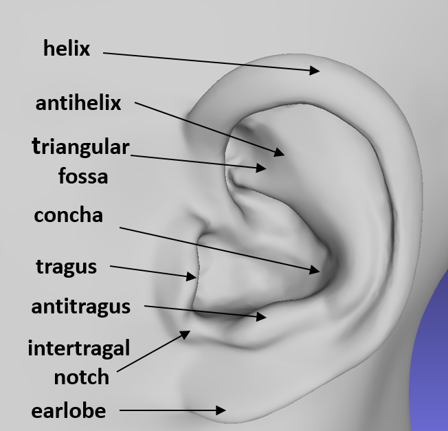
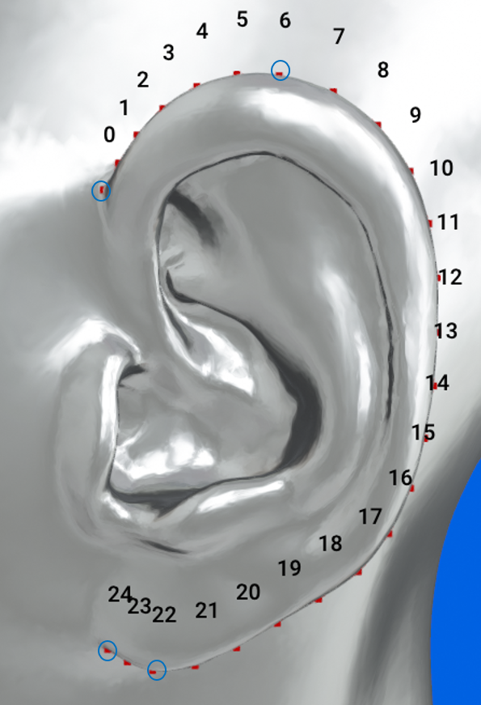
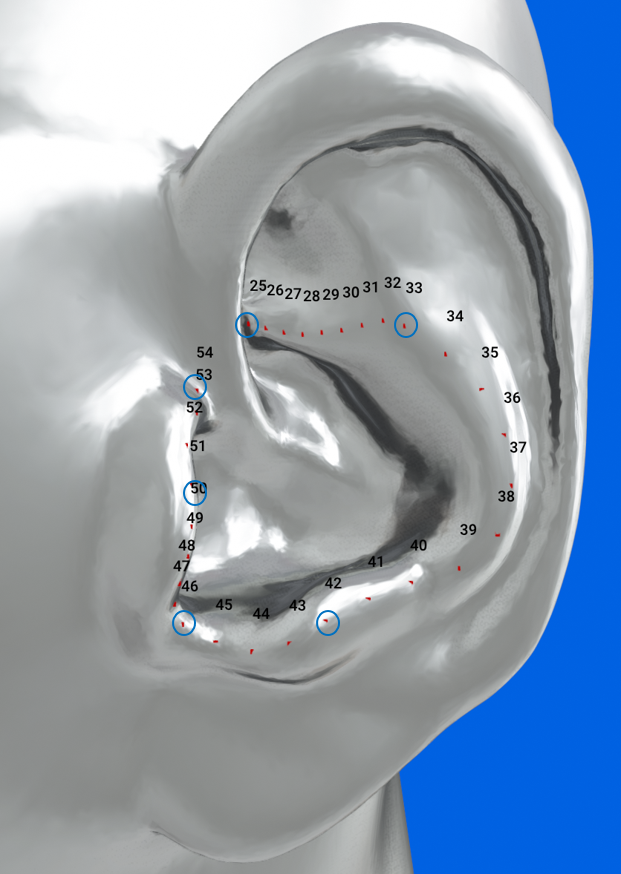
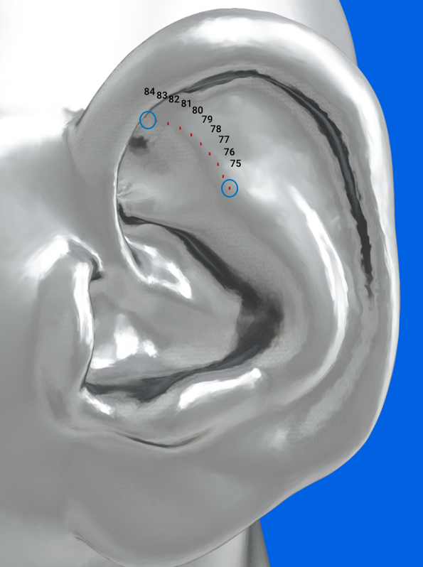

# Tech Arena 2026

The goal of this challenge is to extract landmarks for the pinna shape from the 3D head scans of a human subject. The submitted models are expected to accept a 3D mesh as the input and output precise landmarks of the pinna shape as illustrated in Figure below.


For this task, the 3D meshes provided are aligned along the interaural axis as
- The Y-axis runs along the left ear canal to the right ear canal entrance. 
- The X-axis is from the back of the head to the front of the head, passing the tip of the nose. 
- The Z-axis runs vertically towards the top of the head.
- The center of the head is defined by the intersection of the above-defined X, Y, and Z axes. 


This anatomical alignment ensures that all annotations are made consistently across subjects.

# Preparation

## Dataset

A dataset consisting of 3D meshes of the head and torso for 200 subjects along with 85 landmarks of the left and right pinna is provided.

**To obtain access to the dataset, a *data sharing permission form* needs to be signed by all team members. The form can be obtained by navigating to the *submission section* of your team. Please download the form, fill in the names of *all* team members as well as their signatures, and upload the signed document on the same page. Please also provide a single email address of one of the team members to which the download information will be sent.**

**After submission of the signed form, you will receive an email giving you access to the datasets. We try to keep the time between submission and access as short as possible, but since there is manual work involved, it might take several days before you can access the data.**


## Code

Set up your python environment and install all required packages.

```bash
pip install -r requirements.txt
```

For details on how to use the provided code resources, see the [Jupyter notebook](getting_started.ipynb).


# Evaluation

All submitted models will be evaluated on an undisclosed set of subjects. The performance of this task is evaluated by comparing the predicted landmarks with the ground truth landmarks.

Given a set of $N$ ground truth landmarks for one ear of subject $j$, $$L^{j, ear}_{gt} = \{ l^{j, ear}_{gt, 1}, l^{j, ear}_{gt, 2},\ldots l^{j, ear}_{gt, N} \},$$ and a set of $N$ predicted landmarks, $$L^{j,ear}_{out} = \{ l^{j, ear}_{out, 1}, l^{j, ear}_{out, 2},\ldots,l^{j, ear}_{out, N} \},$$ where and $l^{j, ear}_{gt, i}, l^{j, ear}_{out, i} \in \mathbb{R}^3$ represent the coordinates of the $i^{th}$ landmark in each set.

The mean Euclidean distance for a single set of landmarks is computed by
$$ d\left(L^{j, ear}_{out}, L^{j, ear}_{gt}\right) =\frac{1}{N} \sum_{i=1}^{N} \left\lVert l^{j, ear}_{out, i} - l^{j, ear}_{gt, i} \right\rVert $$

The overall performance is then computed by averaging those distances across all $M$ subjects and all ears of the hidden test set: $$ MD =\frac{1}{2M} \sum_{j=1}^{M} \sum_{ear}  d\left(L^{j, ear}_{out}, L^{j, ear}_{gt}\right), $$ with $ear \in \{ \text{left}, \text{right} \}$.

This metric is implemented in the [`metrics.py`](src/metrics.py) module.


# Submission

Systems need to be submitted through the challenge platform, and can be updated at any time before the end of the challenge. Only the latest submission will be considered for each team and will be displayed on the leaderboard of the challenge.

Each submitted model needs to implement the `LandmarkExtractor` class in the [`estimator.py`](src/estimator.py) module. This class will be used for automatic evaluation on a hidden test data set, and the score will be reported on the leaderboard.

The final submission at the end of the challenge must include:
1. the source code to extract pinna landmarks for left and right pinna.
2. a brief documentation of the algorithm
3. for AI-based solutions: the training code as well as a reference to any additional datasets used.


# Background

*Binaural audio rendering* is the process of simulating sound sources in 3D space around a listener. It is not only used for virtual reality and augmented reality applications, but has made its way into mobile devices to provide immersive user experiences when listening to audio content (music, movies, radio play, etc.). 

In order to provide the illusion of sounds coming from various directions, sound source signals are convolved with so-called *head-related transfer functions (HRTFs)*. Those HRTFs encode the relevant binaural cues that let the listener perceive the sound from a certain direction.

However, HRTFs are influenced by the human anatomy. The pinna for example causes direction-dependent sound reflections and the head causes frequency-dependent sound attenuation due to shadowing effects. Therefore, HRTFs of individuals differ due to anatomic differences. Listening to rendered audio content using HRTFs of a different individual can have a detrimental effect on the perceived sound quality, and can lead to inaccurate localization and an undesired sound color. Hence there is a demand for obtaining *individual HRTFs* to provide personalized audio rendering.

Obtaining accurate individual HRTFs usually requires time-consuming acoustic measurements and does not scale to a large user group. A cost-effective alternative would be to individualize the HRTFs based on anthropometric shapes which can be extracted from the 3D scans. 

The goal of this challenge is to extract the landmarks for the pinna shape from the 3D scans of a human subject.

# Pinna Landmarks

The pinna (or auricle) is the outer ear that captures sound waves and directs them into the ear canal. Pinna plays a key role in the perception of sound, and its effect is unique to each individual. 

The pinna is comprised of following primary components: the helix $\rightarrow$ which forms the ear's overall shape, the antihelix $\rightarrow$ an inner, curved ridge that runs parallel to the helix, and the concha $\rightarrow$ a deep, bowl-shaped hollow adjacent to the ear canal entrance, as illustrated in below Figure.

  
<br />
<br />

The provided pinna anthropometric landmarks can be divided into four distinct pinna contours: the *outer helix*, *outer concha*, *inner helix*, and *superior antihelix*. Each contour consists of two or more *anchor* landmarks that have clearly defined locations on the pinna surface. In between those anchor landmarks, the remaining landmarks are equally distributed, i.e. consecutive landmarks between anchor landmarks all have the same distance. The following section details the positions of the anchor landmarks on each contour.


## Anchor points

| (i) Outer helix contours with 4 fixed point landmarks  | Visualization (25 landmarks) |
| :--- | :--- |
| <ul><li>Index 0: *upper connection of helix with head, at the center of the ridge.*</li><li>Index 6: *upper point of the largest extent of the outer helix, annotated on the top of the ridge.*</li><li>Index 22: *lower point of the largest extent of the outer helix, annotated on the top of the ridge.*</li><li>Index 24: *lower connection of helix with head, at the center of the ridge.*</li></ul> |  |


| (ii) Concha outline with 6 fixed point landmarks | Visualization (30 landmarks) |
| :--- | :--- |
| <ul><li> Index 25: *connection of concha with helix at 90º view*  </li><li> Index 33: *junction of fossa (actually: crura of antihelix) and outer concha contour*.</li><li> Index 42: *antitragus (at highest curvature)*.</li><li> Index 46: *saddle point below tragus* .</li><li> Index 50: *tragus (at highest curvature)*.</li><li> Index 54 *saddle point above tragus*.</li></ul> |  |

| (iii) Inner helix with 3 fixed point landmarks | Visualization (20 landmarks) |
| :--- | :--- |
| <ul><li> Index 55: *inner helix ridge at height of concha start*.</li><li> Index 64: *point opposite the highest point of the outer helix*.</li><li>Index 74: *end point of the continuation of the contour line for another 10 points with the same neighbor distance*.</li></ul> |  |

| (iv) Superior Antihelix with 2 fixed point landmarks| Visualization (10 landmarks) |
| :--- | :--- |
| <ul><li> Index 75: *junction of fossa (actually: crura of antihelix) and outer concha contour*.</li><li> Index 84: *connection of fossa (actually: crura of antihelix) with helix*.</li></ul> |  |


<br />
<br />

Since each landmark is a point in 3D space, a full set of landmarks for a single ear can be represented by a matrix of size 85 x 3.
